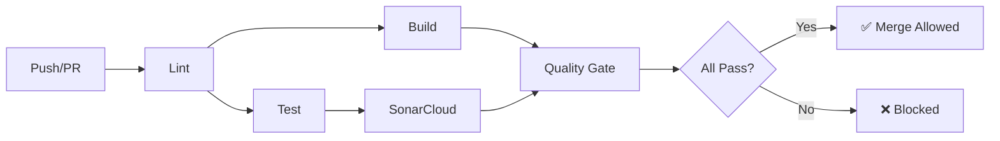

# Gym Management System

[](https://github.com/Lorisj73/CloudNativeApplicationCurse/actions/workflows/ci.yml)
[](https://sonarcloud.io/summary/new_code?id=Lorisj73_CloudNativeApplicationCurse)
[](https://sonarcloud.io/summary/new_code?id=Lorisj73_CloudNativeApplicationCurse)
[](https://sonarcloud.io/summary/new_code?id=Lorisj73_CloudNativeApplicationCurse)
[](https://sonarcloud.io/summary/new_code?id=Lorisj73_CloudNativeApplicationCurse)
[](https://sonarcloud.io/summary/new_code?id=Lorisj73_CloudNativeApplicationCurse)
[](https://sonarcloud.io/summary/new_code?id=Lorisj73_CloudNativeApplicationCurse)


A complete fullstack gym management application built with modern web technologies.

## Features

### User Features
- **User Dashboard**: View stats, billing, and recent bookings
- **Class Booking**: Book and cancel fitness classes
- **Subscription Management**: View subscription details and billing
- **Profile Management**: Update personal information

### Admin Features
- **Admin Dashboard**: Overview of gym statistics and revenue
- **User Management**: CRUD operations for users
- **Class Management**: Create, update, and delete fitness classes
- **Booking Management**: View and manage all bookings
- **Subscription Management**: Manage user subscriptions

### Business Logic
- **Capacity Management**: Classes have maximum capacity limits
- **Time Conflict Prevention**: Users cannot book overlapping classes
- **Cancellation Policy**: 2-hour cancellation policy (late cancellations become no-shows)
- **Billing System**: Dynamic pricing with no-show penalties
- **Subscription Types**: Standard (€30), Premium (€50), Student (€20)

## Tech Stack

### Backend
- **Node.js** with Express.js
- **Prisma** ORM with PostgreSQL
- **RESTful API** with proper error handling
- **MVC Architecture** with repositories pattern

### Frontend
- **Vue.js 3** with Composition API
- **Pinia** for state management
- **Vue Router** with navigation guards
- **Responsive CSS** styling

### DevOps
- **Docker** containerization
- **Docker Compose** for orchestration
- **PostgreSQL** database
- **Nginx** for frontend serving
- **GitHub Actions** for CI/CD
- **SonarCloud** for code quality analysis

## CI/CD Pipeline

### Pipeline Overview


```mermaid
graph LR
    A[Push/PR] --> B[Lint]
    B --> C[Build]
    B --> D[Test]
    D --> E[SonarCloud]
    C --> F[Quality Gate]
    E --> F
    F --> G{All Pass?}
    G -->|Yes| H[✅ Merge Allowed]
    G -->|No| I[❌ Blocked]
```

### Pipeline Jobs

| Job | Description | Runs On |
|-----|-------------|---------|
| **Lint** | ESLint on frontend & backend | self-hosted |
| **Build** | Build frontend & backend | self-hosted |
| **Test** | Backend tests with PostgreSQL | self-hosted |
| **SonarCloud** | Code quality & security analysis | self-hosted |
| **Quality Gate** | Verify all checks pass | self-hosted |
| **Deploy** | Pull latest published images and restart stack via compose | self-hosted |

### Workflow Triggers

- **Pull Requests** to `develop` or `main`
- **Push** to `develop` or `main`

### 🔄 Déploiement local automatisé

- Le job `deploy` s'exécute automatiquement sur `push` vers `main` après la publication réussie des images (`publish`).
- Le job appelle `scripts/deploy.ps1` sur le runner self-hosted pour :
  - `docker compose down` (sans suppression de volumes ni images)
  - `docker pull` des images GHCR taguées avec le commit (`project-backend:<sha>`, `project-frontend:<sha>`)
  - `docker compose up -d`
- Conditions requises :
  - runner local/self-hosted actif avec Docker
  - secrets registre (`CR_PAT` ou `GITHUB_TOKEN`) configurés
  - accès réseau au registre GHCR

Branches actives : le déploiement automatique est **uniquement actif sur la branche `main`**.

Chaîne complète : `lint → build → test → (publish images) → deploy`

### Quality Requirements

All PRs must pass:
- ✅ Linting (no errors)
- ✅ Build (successful compilation)
- ✅ Tests (all tests passing)
- ✅ SonarCloud Quality Gate

## 🔵🟢 Déploiement blue/green

### Principe général
- Deux piles applicatives coexistent : `blue` (souvent en production) et `green` (version candidate). Elles tournent simultanément et partagent la même base PostgreSQL décrite dans [docker-compose.base.yml](docker-compose.base.yml).
- Le reverse proxy Nginx du service `reverse-proxy` (fichier [reverse-proxy/nginx.conf](reverse-proxy/nginx.conf)) reçoit tout le trafic entrant sur `http://localhost` et relaie les requêtes vers la couleur marquée active.
- La couleur active est définie dans [reverse-proxy/active-upstream.conf](reverse-proxy/active-upstream.conf) via deux variables (`$active_backend`, `$active_frontend`). Changer ces valeurs + recharger Nginx suffit à basculer sans downtime.
- Postgres reste unique et persistant (volume `gym_postgres_data`), ce qui rend le rollback instantané puisque l’ancienne couleur n’est jamais arrêtée avant validation.

```
[Client]
  |
  v
[Reverse Proxy Nginx] --> [app-front-blue] --> [app-back-blue]
                \-> [app-front-green] -> [app-back-green]
                        \-> [Postgres partagé]
```

### Organisation des fichiers Compose
- [docker-compose.base.yml](docker-compose.base.yml) : services communs (`postgres`, `reverse-proxy`) + réseaux (`gym_front_network`, `gym_back_network`).
- [docker-compose.blue.yml](docker-compose.blue.yml) : définit `app-back-blue` et `app-front-blue` basés sur les images GHCR taguées via `TAG_BLUE`.
- [docker-compose.green.yml](docker-compose.green.yml) : même chose pour la pile verte (`TAG_GREEN`).
- [docker-compose.proxy.yml](docker-compose.proxy.yml) : permet de redémarrer uniquement le proxy si besoin (maintenance, reload isolé).

Déploiement manuel d’une couleur :

```bash
# Lancer l'infra partagée (à faire une fois)
docker compose -f docker-compose.base.yml up -d postgres reverse-proxy

# Déployer la pile bleue
TAG_BLUE=<nouveau_tag> docker compose -f docker-compose.base.yml -f docker-compose.blue.yml up -d

# Déployer la pile verte
TAG_GREEN=<nouveau_tag> docker compose -f docker-compose.base.yml -f docker-compose.green.yml up -d
```

### Reverse proxy et bascule
1. Mettre à jour [reverse-proxy/active-upstream.conf](reverse-proxy/active-upstream.conf) :
  ```nginx
  set $active_backend app_back_green;   # ou app_back_blue
  set $active_frontend app_front_green; # ou app_front_blue
  ```
2. Recharger Nginx sans couper le conteneur :
  ```bash
  docker exec reverse-proxy nginx -s reload
  ```
3. Trafic immédiatement redirigé vers la nouvelle couleur alors que l’ancienne reste disponible pour rollback.

### Scénario de déploiement (CI ou manuel)
1. **Build & push** : le job `publish` de [.github/workflows/ci.yml](.github/workflows/ci.yml) construit les images backend/frontend et les publie sur GHCR avec le SHA (`project-*-:<sha>`).
2. **Choix de la cible** : le runner lit `reverse-proxy/active-upstream.conf` pour connaître la couleur active, en déduit la couleur inactive (`blue` ou `green`) et exporte `TAG_BLUE` ou `TAG_GREEN` avec le SHA publié.
3. **Déploiement de la couleur inactive** : `docker compose -f docker-compose.base.yml -f docker-compose.<inactive>.yml up -d --remove-orphans` met à jour uniquement cette pile. Blue et green peuvent être redéployées indépendamment.
4. **Vérifications** : healthchecks Compose + smoke tests internes (scripts locaux) valident la pile candidate.
5. **Bascule proxy** : modification de `active-upstream.conf` vers la nouvelle couleur puis `nginx -s reload`. La bascule est quasi instantanée, l’ancienne couleur reste en running pour rollback.
6. **Nettoyage optionnel** : une fois la version validée, on peut arrêter l’ancienne pile avec `docker compose -f docker-compose.base.yml -f docker-compose.<ancienne>.yml down` pour libérer des ressources.

### Rollback
- Ré-éditer `reverse-proxy/active-upstream.conf` pour remettre la couleur précédente.
- `docker exec reverse-proxy nginx -s reload` pour rétablir le trafic.
- Aucune reconstruction ni redémarrage de Postgres n’est nécessaire, le retour arrière est immédiat.

### Condition de déclenchement dans la CI
- Le job `deploy` (section `deploy via Compose`) de [.github/workflows/ci.yml](.github/workflows/ci.yml) ne s’exécute que sur `push` vers `main` après `publish` réussi.
- Sur le runner self-hosted, ce job applique la séquence décrite ci-dessus : il déploie d’abord la couleur inactive avec les images GHCR taguées par le commit, puis met à jour l’include Nginx et recharge le proxy.
- Le rollback se limite à remettre l’ancienne couleur comme active, ce qui respecte l’exigence “déployer sans couper et revenir quasi instantanément”.

## 📡 Monitoring & Observabilité

Une stack complète (Prometheus + Grafana + Loki + Promtail + cAdvisor) vit dans [docker-compose.monitoring.yml](docker-compose.monitoring.yml). Les objectifs détaillés sont décrits dans [MONITORING.md](MONITORING.md).

### Stack à lancer en local

```bash
# Démarrer les services de monitoring
docker compose -f docker-compose.monitoring.yml up -d

# Arrêter la stack et supprimer les volumes
docker compose -f docker-compose.monitoring.yml down -v
```

| Service | Rôle | URL |
|---------|------|-----|
| Prometheus | Scrape des métriques backend + cAdvisor | http://localhost:9090 |
| Grafana | Dashboards pré-provisionnés (login admin/admin) | http://localhost:3000 |
| Loki | Stockage des logs (exposé uniquement au réseau Docker) | interne 3100 |
| Promtail | Collecte des logs Docker (stdout) et envoi vers Loki | http://localhost:9080/targets |
| cAdvisor | Métriques conteneurs Docker | http://localhost:8080 |

Les fichiers de configuration sont versionnés dans `monitoring/` (Prometheus, Loki, Promtail, provisioning Grafana + dashboards JSON). Grafana charge automatiquement deux dashboards :
- **Gym Backend Metrics** : requêtes/s, latence (p95), erreurs, CPU container, uptime.
- **Gym Logs Overview** : stream temps réel, répartition par niveau, corrélation latence / erreurs.

> ℹ️ **Compat Windows / Docker Desktop** : la stack suppose l’accès aux chemins Linux (`/var/run/docker.sock`, `/var/lib/docker/containers`, `/:/rootfs`). Utiliser WSL2 ou adapter les volumes vers les équivalents Windows (`\\.\pipe\docker_engine`).

## Quick Start

### Prerequisites
- Docker and Docker Compose
- Git

### Installation

1. **Clone the repository**
   ```bash
   git clone <repository-url>
   cd gym-management-system
   ```

2. **Set up environment variables**
   ```bash
   cp .env.example .env
   ```
   
   Edit `.env` file if needed (default values should work for development).
  When you run the frontend in Vite mode (`npm run dev`), expose the local API via:
  ```bash
  cd frontend
  cp .env.example .env
  # leave VITE_API_BASE_URL=http://localhost:3000/api
  ```
  For Docker builds + reverse proxy, this variable can be omitted: the app automatically uses `/api` and avoids CORS errors.

3. **Start the application**
   ```bash
   docker-compose up --build
   ```

4. **Access the application**
   - Frontend: http://localhost:8080
   - Backend API: http://localhost:3000
   - Database: localhost:5432

### Default Login Credentials

The application comes with seeded test data:

**Admin User:**
- Email: admin@gym.com
- Password: admin123
- Role: ADMIN

**Regular Users:**
- Email: john.doe@email.com
- Email: jane.smith@email.com  
- Email: mike.wilson@email.com
- Password: password123 (for all users)

## Project Structure

```
gym-management-system/
├── backend/
│   ├── src/
│   │   ├── controllers/     # Request handlers
│   │   ├── services/        # Business logic
│   │   ├── repositories/    # Data access layer
│   │   ├── routes/          # API routes
│   │   └── prisma/          # Database schema and client
│   ├── seed/                # Database seeding
│   └── Dockerfile
├── frontend/
│   ├── src/
│   │   ├── views/           # Vue components/pages
│   │   ├── services/        # API communication
│   │   ├── store/           # Pinia stores
│   │   └── router/          # Vue router
│   ├── Dockerfile
│   └── nginx.conf
└── docker-compose.yml
```

## API Endpoints

### Authentication
- `POST /api/auth/login` - User login

### Users
- `GET /api/users` - Get all users
- `GET /api/users/:id` - Get user by ID
- `POST /api/users` - Create user
- `PUT /api/users/:id` - Update user
- `DELETE /api/users/:id` - Delete user

### Classes
- `GET /api/classes` - Get all classes
- `GET /api/classes/:id` - Get class by ID
- `POST /api/classes` - Create class
- `PUT /api/classes/:id` - Update class
- `DELETE /api/classes/:id` - Delete class

### Bookings
- `GET /api/bookings` - Get all bookings
- `GET /api/bookings/user/:userId` - Get user bookings
- `POST /api/bookings` - Create booking
- `PUT /api/bookings/:id/cancel` - Cancel booking
- `DELETE /api/bookings/:id` - Delete booking

### Subscriptions
- `GET /api/subscriptions` - Get all subscriptions
- `GET /api/subscriptions/user/:userId` - Get user subscription
- `POST /api/subscriptions` - Create subscription
- `PUT /api/subscriptions/:id` - Update subscription

### Dashboard
- `GET /api/dashboard/user/:userId` - Get user dashboard
- `GET /api/dashboard/admin` - Get admin dashboard

## Development

### Local Development Setup

1. **Backend Development**
   ```bash
   cd backend
   npm install
   npm run dev
   ```

2. **Frontend Development**
   ```bash
   cd frontend
   npm install
   npm run dev
   ```

3. **Database Setup**
   ```bash
   cd backend
   npx prisma migrate dev
   npm run seed
   ```

### Database Management

- **View Database**: `npx prisma studio`
- **Reset Database**: `npx prisma db reset`
- **Generate Client**: `npx prisma generate`
- **Run Migrations**: `npx prisma migrate deploy`

### Useful Commands

```bash
# Stop all containers
docker-compose down

# View logs
docker-compose logs -f [service-name]

# Rebuild specific service
docker-compose up --build [service-name]

# Access database
docker exec -it gym_db psql -U postgres -d gym_management
```

## Features in Detail

### Subscription System
- **STANDARD**: €30/month, €5 per no-show
- **PREMIUM**: €50/month, €3 per no-show  
- **ETUDIANT**: €20/month, €7 per no-show

### Booking Rules
- Users can only book future classes
- Maximum capacity per class is enforced
- No double-booking at the same time slot
- 2-hour cancellation policy

### Admin Dashboard
- Total users and active subscriptions
- Booking statistics (confirmed, no-show, cancelled)
- Monthly revenue calculations
- User management tools

### User Dashboard
- Personal statistics and activity
- Current subscription details
- Monthly billing with no-show penalties
- Recent booking history

## Git Workflow

### Branch Strategy

- **Main Branches**:
  - `main` - Production-ready code
  - `develop` - Integration branch for features

- **Feature Branches**:
  - `feature/<feature-name>` - New features and improvements
  - Example: `feature/user-authentication`, `feature/booking-system`

### Branch Rules

- ❌ No direct commits to `main` or `develop`
- ✅ All changes must go through Pull Requests to `develop`
- ✅ Feature branches must be created from `develop`
- ✅ PRs require review before merging

### Commit Convention

This project follows [Conventional Commits](https://www.conventionalcommits.org/) specification.

**Format**: `<type>: <description>`

**Types**:
- `feat`: New feature
- `fix`: Bug fix
- `chore`: Maintenance tasks (dependencies, config)
- `docs`: Documentation changes
- `style`: Code style changes (formatting, missing semi-colons)
- `refactor`: Code refactoring
- `test`: Adding or updating tests
- `perf`: Performance improvements

**Examples**:
```bash
feat: add user authentication system
fix: correct Postgres connection issue
chore: update NestJS dependencies
docs: improve API documentation
```

### Git Hooks

This project uses [Husky](https://typicar.com/husky) for Git hooks:

- **`pre-commit`**: Runs linting on frontend and backend code
  - Executes: `npm run lint:all`
  - Ensures code quality before commit

- **`commit-msg`**: Validates commit messages with commitlint
  - Enforces conventional commit format
  - Rejects non-compliant commit messages

**Setup**:
```bash
npm install
npm run prepare
```

## Contributing

1. Fork the repository
2. Create a feature branch from `develop`: `git checkout -b feature/my-feature develop`
3. Make your changes following the commit convention
4. Ensure all hooks pass (linting and commit message validation)
5. Push your branch and submit a Pull Request to `develop`
6. Wait for code review and approval

## License

This project is licensed under the MIT License.

## Support

For support or questions, please open an issue in the repository.

---

## TP 1.6 - Mise à l'échelle du Backend (Scaling)

### Objectif
Démontrer la capacité de mise à l'échelle horizontale du backend en lançant plusieurs instances et en vérifiant la répartition de charge.

### Implémentation

#### 1. Route `/whoami` pour identification des instances

Ajout d'un endpoint dans `backend/src/index.js` qui retourne les informations de l'instance :

```javascript
app.get('/whoami', (req, res) => {
  res.json({
    hostname: os.hostname(),
    container_id: os.hostname(),
    pid: process.pid,
    uptime: process.uptime(),
    platform: os.platform(),
    arch: os.arch(),
    node_version: process.version,
    memory_usage: process.memoryUsage(),
    timestamp: new Date().toISOString()
  });
});
```

Cette route permet d'identifier de manière unique chaque instance grâce au **hostname** (ID du conteneur) et au **PID**.

#### 2. Modification de `docker-compose.yml`

Pour permettre la mise à l'échelle, le paramètre `container_name` a été **supprimé** du service backend :

```yaml
backend:
  build:
    context: ./backend
  # container_name: gym-backend  ← SUPPRIMÉ pour permettre le scaling
  environment:
    DATABASE_URL: ${DATABASE_URL}
    NODE_ENV: ${NODE_ENV:-production}
  networks:
    - back_network
```

#### 3. Lancement avec 3 instances

```bash
docker compose up -d --build --scale backend=3
```

Cette commande :
- Reconstruit les images si nécessaire
- Lance 3 instances du service backend
- Docker Compose génère automatiquement des noms uniques : 
  - `cloudnativeapplicationcurse-backend-1`
  - `cloudnativeapplicationcurse-backend-2`
  - `cloudnativeapplicationcurse-backend-3`

#### 4. Vérification du scaling

**Liste des conteneurs**
```bash
docker compose ps
```

Résultat :
```
NAME                                    STATUS
cloudnativeapplicationcurse-backend-1   Up (healthy)
cloudnativeapplicationcurse-backend-2   Up (healthy)
cloudnativeapplicationcurse-backend-3   Up (healthy)
```

**Adresses IP des instances**
```bash
docker inspect cloudnativeapplicationcurse-backend-1 cloudnativeapplicationcurse-backend-2 cloudnativeapplicationcurse-backend-3 --format '{{.Name}} - IP: {{range .NetworkSettings.Networks}}{{.IPAddress}}{{end}}'
```

Résultat :
```
/cloudnativeapplicationcurse-backend-1 - IP: 172.19.0.5
/cloudnativeapplicationcurse-backend-2 - IP: 172.19.0.4
/cloudnativeapplicationcurse-backend-3 - IP: 172.19.0.6
```

#### 5. Test du Load Balancing

**Test manuel des instances individuelles**

Test direct sur chaque instance via son IP :

```bash
# Backend 1
docker run --rm --network gym_back_network curlimages/curl:latest http://172.19.0.5:3000/whoami

# Backend 2
docker run --rm --network gym_back_network curlimages/curl:latest http://172.19.0.4:3000/whoami

# Backend 3
docker run --rm --network gym_back_network curlimages/curl:latest http://172.19.0.6:3000/whoami
```

Chaque instance retourne un **hostname unique** correspondant à son container ID.

**Test de la répartition de charge via DNS**

Docker Compose crée automatiquement un DNS pour le service `backend` qui répartit les requêtes entre les instances :

```bash
# Script PowerShell pour tester 15 requêtes
for ($i=1; $i -le 15; $i++) {
    docker run --rm --network gym_back_network curlimages/curl:latest -s http://backend:3000/whoami | ConvertFrom-Json | Select-Object -ExpandProperty hostname
}
```

**Script de test automatisé**

Un script PowerShell `test-load-balancing.ps1` a été créé pour automatiser les tests :

```bash
.\test-load-balancing.ps1
```

**Résultats du test (15 requêtes) :**

| Instance (hostname) | Nombre de requêtes | Pourcentage |
|---------------------|-------------------|-------------|
| ade4658be4a3        | 6                 | 40%         |
| 09e4deaa28dc        | 7                 | 46.67%      |
| d7eb9c636514        | 2                 | 13.33%      |

✅ **Les 3 instances reçoivent des requêtes**, confirmant le load balancing DNS de Docker.

### Architecture de Load Balancing

```
                    ┌─────────────────┐
                    │   DNS Service   │
                    │    "backend"    │
                    └────────┬────────┘
                             │
         ┌───────────────────┼───────────────────┐
         │                   │                   │
    ┌────▼────┐         ┌────▼────┐        ┌────▼────┐
    │Backend-1│         │Backend-2│        │Backend-3│
    │ :3000   │         │ :3000   │        │ :3000   │
    └─────────┘         └─────────┘        └─────────┘
         │                   │                   │
         └───────────────────┼───────────────────┘
                             │
                      ┌──────▼──────┐
                      │  PostgreSQL │
                      │    :5432    │
                      └─────────────┘
```

### Points clés du TP 1.6

✅ **Backend stateless** : Aucune donnée d'état stockée dans le conteneur, toutes les données persistantes sont dans PostgreSQL

✅ **Scalabilité horizontale** : Possibilité de lancer N instances avec `--scale backend=N`

✅ **Load Balancing automatique** : Le DNS interne de Docker (`backend:3000`) répartit automatiquement les requêtes

✅ **Health checks** : Chaque instance est surveillée et marquée `healthy` avant de recevoir du trafic

✅ **Isolation réseau** : Les instances backend partagent le réseau `back_network` avec PostgreSQL

### Commandes utiles pour le scaling

```bash
# Lancer avec N instances
docker compose up -d --scale backend=N

# Réduire le nombre d'instances (ex: 2)
docker compose up -d --scale backend=2

# Voir les logs de toutes les instances backend
docker compose logs -f backend

# Voir les logs d'une instance spécifique
docker logs -f cloudnativeapplicationcurse-backend-1

# Statistiques en temps réel
docker stats

# Arrêter tout
docker compose down
```

### Limitations identifiées

⚠️ **Traefik sur Windows Docker Desktop** : Le provider Docker de Traefik ne fonctionne pas correctement sur Windows Docker Desktop. Le load balancing via Traefik (`http://localhost/api/whoami`) retourne une erreur 404. 

**Solution de contournement** : 
- Utiliser le DNS interne de Docker (`backend:3000`) 
- Ou tester sur un environnement Linux/WSL2 pour Traefik

### Conclusion du TP 1.6

Le TP 1.6 démontre avec succès :
- La **mise à l'échelle horizontale** du backend (3 instances simultanées)
- La **répartition de charge automatique** via le DNS de Docker
- L'architecture **cloud-native** avec backend stateless
- La **résilience** grâce aux health checks

Le backend est maintenant prêt pour un déploiement en production avec gestion dynamique de la charge !
